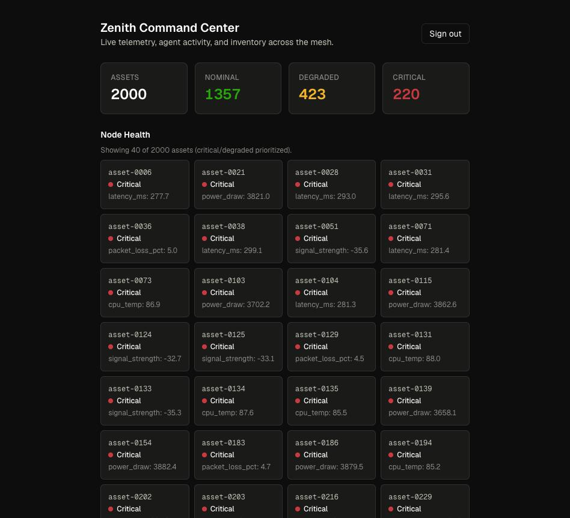
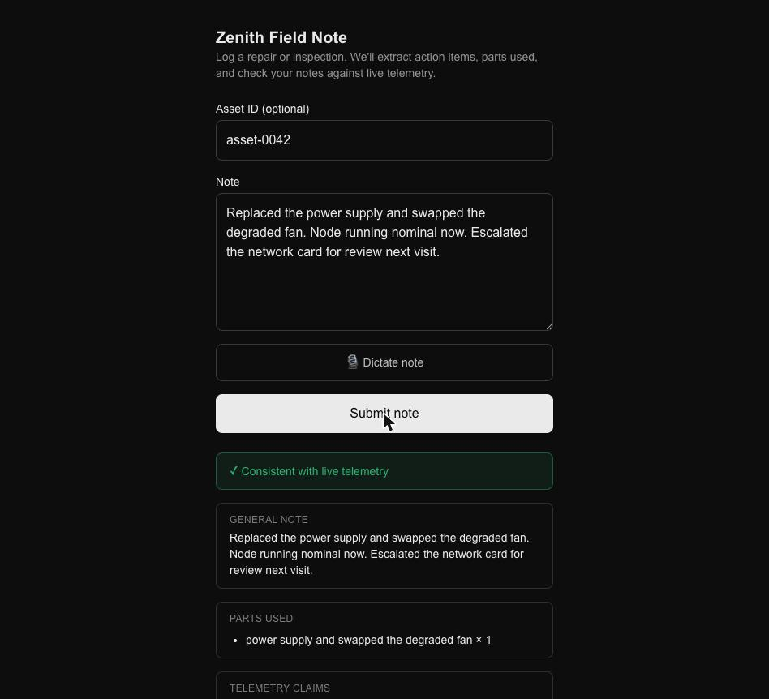
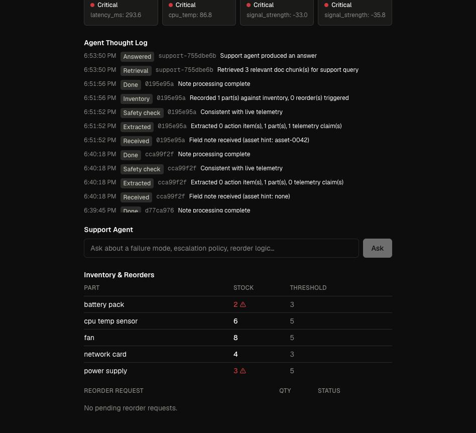

# Zenith

**An AI-native operations platform for critical infrastructure** — real-time
telemetry, an AI field notetaker, closed-loop inventory management, and an
AI support agent, unified behind a single command center.

Zenith is a "system of systems" built to demonstrate what it takes to run
physical infrastructure (data centers, satellite ground stations,
distributed retail networks) with software: high-concurrency telemetry
ingestion, natural-language field reporting that becomes structured data,
inventory that reacts to what technicians actually do in the field, and an
AI agent grounded in the operation's own runbooks.

**Live demo:**

| App | URL |
|---|---|
| Command Center (dashboard) | https://zenith-dashboard-one.vercel.app |
| Field App (technician UI) | https://zenith-field-app.vercel.app |

Demo credentials: `admin` / `admin-demo-pw` (admin) and
`field-tech-service` / `field-tech-demo-pw` (field technician).

> Backend services run on Render's free tier and spin down when idle —
> the first request after a period of inactivity can take up to ~30s to
> wake up.

<p align="center">
  
</p>

<table>
<tr>
<td width="50%">
  
  <p align="center"><sub>Field app — raw note in, structured extraction + telemetry check out</sub></p>
</td>
<td width="50%">
  
  <p align="center"><sub>Agent thought log + live inventory, with low-stock parts flagged</sub></p>
</td>
</tr>
</table>

---

## Architecture

Zenith is a monorepo of five independently deployable services, each
chosen for the problem it's best suited to:

```
┌─────────────────┐        ┌──────────────────┐        ┌─────────────────────┐
│   Field App      │──────▶│  Notetaker MCP    │◀──────│  Command Center      │
│   (Next.js)       │       │  (FastAPI + MCP)  │        │  Dashboard (Next.js) │
└─────────────────┘        └────────┬─────────┘        └──────────┬──────────┘
                                     │                              │
                    ┌────────────────┼──────────────────────────────┤
                    ▼                ▼                              ▼
          ┌──────────────────┐  ┌──────────────────┐    ┌──────────────────┐
          │ Ingestion Mesh    │  │ Inventory Service │◀──│  Postgres (Neon)  │
          │ (Go)              │  │ (FastAPI)          │   └──────────────────┘
          └──────────────────┘  └──────────────────┘
```

| Service | Stack | Responsibility |
|---|---|---|
| **ingestion-mesh** | Go | High-concurrency telemetry ingestion & in-memory time-series store, simulating thousands of asset health packets (latency, power draw, signal strength, packet loss) |
| **notetaker-mcp** | Python (FastAPI + MCP) | Turns raw field notes into structured data via an LLM (Gemini, with a deterministic mock fallback), cross-checks technician claims against live telemetry, and answers operational questions grounded in internal runbooks |
| **inventory-service** | Python (FastAPI) | Postgres-backed inventory, RBAC, and autonomous re-order logic |
| **field-app** | Next.js | Mobile-first technician UI for filing field notes (with voice dictation) |
| **dashboard** | Next.js | Command center: live telemetry, inventory state, agent thought log, and support-agent chat, via a server-side BFF layer |

### Why this stack

- **Go for ingestion** — the telemetry mesh needs to sustain high-volume
  concurrent writes; goroutines and channels make that cheap without
  reaching for a message broker.
- **Python + MCP for the AI layer** — the field-note pipeline is exposed
  both as a plain HTTP API (for the web apps) and as a real MCP server
  (stdio transport), so any MCP-aware client (Claude Code, Claude Desktop)
  can drive it directly as a tool.
- **Postgres for inventory** — parts, installations, and re-order requests
  are inherently relational, with real constraints (one pending re-order
  per part, RBAC-gated writes) that a document store would make awkward.
- **Next.js for both frontends** — the dashboard never exposes backend URLs
  to the browser; all cross-service calls go through server-side Route
  Handlers (`dashboard/lib/backend.ts`), keeping infrastructure endpoints
  off the client entirely.

---

## Core flows

**Closed-loop field repair.** A technician submits a note ("Replaced the
power supply, running fine now") through the field app. The notetaker
extracts a structured summary, action items, and parts used; cross-checks
the claim against the asset's live telemetry (flagging it if the node is
still reporting `critical`); and forwards any parts used to the inventory
service, which decrements stock and — if that pushes a part below its
re-order threshold — automatically opens a re-order request.

**Grounded support agent.** The dashboard's support agent answers
operational questions ("what's the escalation policy for a critical power
supply failure?") using retrieval over `docs/runbooks/` rather than general
knowledge, and cites which runbook it drew from.

**RBAC.** JWT-based auth with two roles: `field_tech` can file notes and
install parts against their own jobs; `admin` can additionally adjust
pricing and global inventory state. Enforced at the API layer
(`inventory-service/inventory/routes.py`), not just in the UI.

---

## Repository layout

```
ingestion-mesh/       Go telemetry ingestion service
  cmd/ingestor/        entrypoint
  internal/telemetry/  packet schema + validation
  internal/ingest/     ingestion pipeline
  internal/simulator/  synthetic asset traffic generator
  internal/store/      in-memory time-series store
  internal/api/        HTTP handlers (/health, /assets, /metrics)

notetaker-mcp/         Python field-note & support-agent service
  notetaker/core.py         note processing pipeline
  notetaker/safety.py       telemetry-contradiction checks
  notetaker/support_agent.py retrieval-grounded Q&A over docs/runbooks
  notetaker/inventory_client.py client for inventory-service
  notetaker/http_api.py     FastAPI app (/notes, /events, /support/ask)
  notetaker/mcp_server.py   MCP stdio server exposing the same tools

inventory-service/     Python inventory & RBAC service
  inventory/routes.py       API (auth, parts, installations, re-orders)
  inventory/security.py     JWT + password hashing + role checks
  db/schema.sql             Postgres schema
  db/seed.py                demo data seeding

field-app/              Next.js technician field UI
dashboard/               Next.js command center (BFF pattern)
docs/runbooks/           Internal ops docs the support agent is grounded in
```

---

## Running locally

Each service has its own `.env.example` — copy to `.env` and fill in
values before starting.

```bash
# 1. Ingestion mesh (Go)
cd ingestion-mesh && go run ./cmd/ingestor          # :8080

# 2. Inventory service (Python)
cd inventory-service
python -m venv .venv && source .venv/bin/activate
pip install -r requirements.txt
psql "$DATABASE_URL" -f db/schema.sql
python -m db.seed
uvicorn inventory.main:app --port 8001               # :8001

# 3. Notetaker MCP service (Python)
cd notetaker-mcp
python -m venv .venv && source .venv/bin/activate
pip install -r requirements.txt
uvicorn notetaker.http_api:app --port 8000            # :8000
# omit GEMINI_API_KEY to run on a deterministic mock instead of a real LLM

# 4. Field app & dashboard (Next.js)
cd field-app && npm install && npm run dev            # :3000
cd dashboard && npm install && npm run dev             # :3001
```

Or bring up the three backend services in containers:

```bash
docker compose up
```

Full production deployment steps (Neon, Render, Vercel) are in
[`DEPLOYMENT.md`](./DEPLOYMENT.md).

---

## Testing

```bash
# Go
cd ingestion-mesh && go test ./...

# Python (each service)
cd notetaker-mcp && pytest
cd inventory-service && pytest
```

---

## Deployment

- **Database:** Neon (serverless Postgres)
- **Backend services:** Render (Docker, deployed from this repo)
- **Frontends:** Vercel (two projects, one per app, via monorepo root-directory config)

See [`DEPLOYMENT.md`](./DEPLOYMENT.md) for the full setup guide, including
environment variables required per service.
